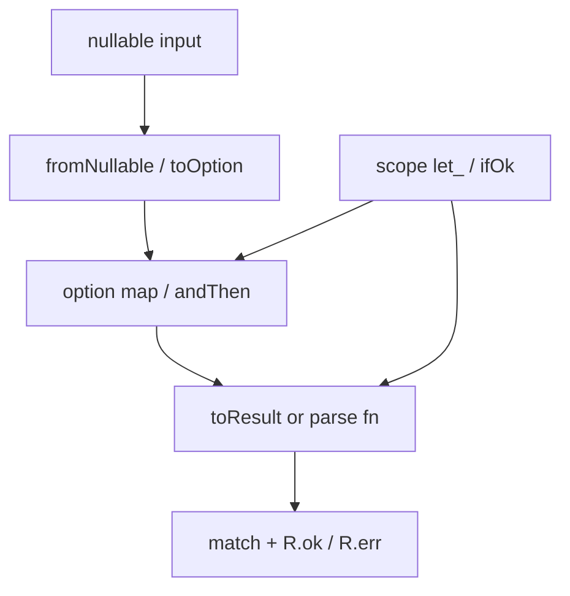

# ts-prelude

Functional prelude for TypeScript. Composes **neverthrow**, **ts-pattern**, and **remeda** — does not replace them.

- ESM-only, `"sideEffects": false`, tree-shakeable.
- **Always use subpath imports.** Root (`@ur-wesley/ts-prelude`) exports only `VERSION`.

## Install

```bash
bun add @ur-wesley/ts-prelude
```

Works with npm/pnpm/yarn. This skill ships in the package — copy or symlink into your project:

```
node_modules/@ur-wesley/ts-prelude/.cursor/skills/ts-prelude/
→ your-project/.cursor/skills/ts-prelude/
```

## Import cheat sheet

```ts
import { VERSION } from "@ur-wesley/ts-prelude";

import {
  some,
  none,
  fromNullable,
  map,
  andThen,
  getOrElse,
  filter,
  orElse,
  zip,
} from "@ur-wesley/ts-prelude/option";
import {
  ok,
  err,
  matchResult,
  traverse,
  traverseOption,
  combineWithAllErrors,
  runCatching,
  map2,
  Result,
  ResultAsync,
} from "@ur-wesley/ts-prelude/result";
import {
  match,
  R,
  O,
  P,
  isMatching,
  when,
  whenMatch,
} from "@ur-wesley/ts-prelude/match";
import {
  let_,
  run,
  apply,
  also,
  with_,
  ifSome,
  ifOk,
  ifErr,
  ifDefined,
  takeIf,
  takeUnless,
  require,
} from "@ur-wesley/ts-prelude/scope";
import { fromArray, first, last } from "@ur-wesley/ts-prelude/iter";
import { pipe, flow, tap, dbg, pipeResult } from "@ur-wesley/ts-prelude/pipe";
import { logger, createConsola } from "@ur-wesley/ts-prelude/log";
import {
  fromNullable,
  toOption,
  toResult,
} from "@ur-wesley/ts-prelude/interop";
import {
  brand,
  tag,
  assertNever,
  refine,
  head,
} from "@ur-wesley/ts-prelude/types";
import { copy, update, updatePath } from "@ur-wesley/ts-prelude/record";
import {
  retry,
  withTimeout,
  race,
  parallel,
  asyncTraverse,
} from "@ur-wesley/ts-prelude/async";
import {
  defer,
  usingResource,
  using,
  usingAsync,
} from "@ur-wesley/ts-prelude/resource";
import { lazy, once } from "@ur-wesley/ts-prelude/lazy";
import { wire } from "@ur-wesley/ts-prelude/wire";
import {
  defineConfig,
  string,
  number,
  boolean,
  enum_,
} from "@ur-wesley/ts-prelude/config";

import { filter } from "@ur-wesley/ts-prelude/data/filter";
import { map } from "@ur-wesley/ts-prelude/data/map";
import { groupBy } from "@ur-wesley/ts-prelude/data/groupBy";
import { pick } from "@ur-wesley/ts-prelude/data/pick";
import { omit } from "@ur-wesley/ts-prelude/data/omit";
import { partition } from "@ur-wesley/ts-prelude/data/partition";
import { uniqueBy } from "@ur-wesley/ts-prelude/data/uniqueBy";
import { sortBy } from "@ur-wesley/ts-prelude/data/sortBy";
import { find } from "@ur-wesley/ts-prelude/data/find";
import { reduce } from "@ur-wesley/ts-prelude/data/reduce";
import { range } from "@ur-wesley/ts-prelude/data/range";
import { zip } from "@ur-wesley/ts-prelude/data/zip";
import { chunk } from "@ur-wesley/ts-prelude/data/chunk";
```

Import only the subpaths you need. Do not import from the package root for application logic.

## When to use which module

| User need | Import from | Key APIs |
| --------- | ----------- | -------- |
| nullable / missing value | `option` or `interop` | `fromNullable`, `some`, `none`, `map`, `andThen`, `toOption` |
| fallible operation / errors | `result` | `ok`, `err`, `matchResult`, `traverse`, `runCatching`, `combineWithAllErrors` |
| exhaustive branching | `match` | `match`, `R.ok()`, `R.err()`, `O.some()`, `O.none()`, `whenMatch` |
| Kotlin-style scope | `scope` | `let_`, `run`, `apply`, `also`, `with_`, `ifSome`, `takeIf`, `require` |
| lazy sequences | `iter` | `fromArray`, `.flatMap`, `.skip`, `.enumerate`, `first`, `last` |
| piping / composition | `pipe` | `pipe`, `flow`, `tap`, `dbg`, `pipeResult` |
| logging | `log` | `logger`, `createConsola` — not `console.log` |
| async retries / timeouts | `async` | `retry`, `withTimeout`, `race`, `parallel`, `asyncTraverse` |
| cleanup / RAII | `resource` | `defer`, `usingResource`, `using`, `usingAsync` |
| lazy memoization | `lazy` | `lazy`, `once` |
| branded types / ADTs | `types` | `brand`, `refine`, `tag`, `assertNever`, `head` |
| immutable records | `record` | `copy`, `update`, `updatePath` |
| app bootstrap wiring | `wire` | `wire`, `wireError` — composition root only, not a service locator |
| env / app config | `config` | `defineConfig`, `string`, `number`, `boolean`, `enum_`, `optional` |
| one data helper | `data/<fn>` | e.g. `data/filter`, `data/map`, `data/groupBy` |

## Mental model

- **Option** ≈ Rust `Option<T>` — `some` / `none`, `map`, `andThen`, `getOrElse`.
- **Result** ≈ Rust `Result<T, E>` via neverthrow — `ok` / `err`, `matchResult`, `traverse`.
- **match** ≈ Rust `match` with ts-pattern — use `R` / `O` helpers for Result and Option shapes.
- **scope** ≈ Kotlin `let` / `run` / `apply` / `also` / `with` plus `ifSome` / `ifOk` guards.

## Patterns to prefer

1. **Nullable input** → `fromNullable(value)` or `toOption(value)` instead of `if (x != null)` chains.
2. **Parsing / validation** → return `Result<T, E>` with `ok` / `err`; combine with `traverse` for collections.
3. **Branching on Result/Option** → `matchResult` or `match(x).with(R.ok(), ...).with(R.err(), ...).exhaustive()`.
4. **Transform in place** → `let_(value, fn)` or `pipe(value, fn1, fn2)`.
5. **Side-effect logging** → `logger` from `/log`, or `tap` / `dbg` in pipes.
6. **Single array/object helper** → `@ur-wesley/ts-prelude/data/<name>` (one remeda function per file).
7. **App composition root** → `wire({ ... }).resolve()` instead of chained `if (isErr())` bootstrap blocks.
8. **Env config** → `defineConfig({ port: number(3000, { envKey: "PORT" }) })` instead of hand-rolled `process.env` parsing.

## Anti-patterns

- `import { map } from "@ur-wesley/ts-prelude"` — root export is minimal.
- `console.log` when structured logging is intended — use `logger` from `/log`.
- Hand-rolled `Option` / `Result` types when this package already provides them.
- `import * as R from "remeda"` when only `filter` is needed — use `data/filter`.
- Non-exhaustive `if/else` on tagged unions when `match` + `.exhaustive()` fits.
- Global service locators or runtime IoC containers when `wire` + explicit deps suffice.

## Underlying libraries

Users may already depend on these directly; this package is a curated facade:

| Subpath | Underlying | Notes |
| ------- | ---------- | ----- |
| `result` | neverthrow | `Result`, `ResultAsync`, `okAsync`, `fromPromise`, `fromThrowable`, `safeTry` re-exported |
| `match` | ts-pattern | `match`, `P`, `isMatching` re-exported; `R` / `O` are local helpers |
| `pipe` | remeda | `pipe`, `piped` re-exported; `flow`, `compose`, `tap`, `dbg` are local |
| `data/*` | remeda | One function per subpath for tree-shaking |

## Examples

### Option

```ts
import {
  some,
  none,
  fromNullable,
  map,
  andThen,
  getOrElse,
} from "@ur-wesley/ts-prelude/option";

const x = some(42);
map(x, (n) => n * 2);
andThen(fromNullable("hi"), (s) => (s.length > 0 ? some(s.length) : none()));
getOrElse(none(), 0);
```

### Result

```ts
import { ok, err, matchResult, traverse } from "@ur-wesley/ts-prelude/result";

const parsed = (s: string) => (s.length > 0 ? ok(s.length) : err("empty"));

matchResult(parsed("hi"), {
  ok: (n) => `length ${n}`,
  err: (e) => `failed: ${e}`,
});

traverse(["a", "bb"], parsed);
```

### Pattern matching

```ts
import { match, R, O } from "@ur-wesley/ts-prelude/match";
import { ok } from "@ur-wesley/ts-prelude/result";
import { some } from "@ur-wesley/ts-prelude/option";

match(ok(1))
  .with(R.ok(), (r) => r.value)
  .with(R.err(), (r) => r.error)
  .exhaustive();

match(some("hi"))
  .with(O.some(), (o) => o.value)
  .with(O.none(), () => null)
  .exhaustive();
```

### Scope

```ts
import { let_, run, also, with_, ifSome, ifOk } from "@ur-wesley/ts-prelude/scope";
import { some } from "@ur-wesley/ts-prelude/option";
import { ok } from "@ur-wesley/ts-prelude/result";
import { logger } from "@ur-wesley/ts-prelude/log";

let_(5, (n) => n * 2);
run("hi", (s) => s.length);
also(1, (n) => logger.info(n));
with_(1, 2, (a, b) => a + b);
ifSome(some(2), (n) => n * 2);
ifOk(ok(1), (n) => n + 1);
```

### Pipe / flow

```ts
import { pipe, flow } from "@ur-wesley/ts-prelude/pipe";

pipe(1, (n) => n + 1, (n) => n * 2);
flow((n: number) => n + 1, (n) => n * 2)(1);
```

### Lazy iterators

```ts
import { fromArray } from "@ur-wesley/ts-prelude/iter";

fromArray([1, 2, 3, 4])
  .filter((n) => n % 2 === 0)
  .map((n) => n * 10)
  .take(1)
  .collect();
```

### Wire (composition root)

```ts
import { wire } from "@ur-wesley/ts-prelude/wire";
import { defineConfig, number } from "@ur-wesley/ts-prelude/config";
import { ok } from "@ur-wesley/ts-prelude/result";

const app = wire({
  config: () => defineConfig({ port: number(3000, { envKey: "PORT" }) }),
  db: ({ config }) => createDb(config),
  users: ({ db }) => ok(createUserRepo(db)),
});

const resolved = app.resolve();
```

Factories run in definition order; declare dependencies before dependents. Pass `dispose` for reverse-order cleanup.

### Config

```ts
import {
  defineConfig,
  string,
  number,
  boolean,
  enum_,
} from "@ur-wesley/ts-prelude/config";
import { match, R } from "@ur-wesley/ts-prelude/match";
import { logger } from "@ur-wesley/ts-prelude/log";

const config = defineConfig({
  name: string({ envKey: "NAME" }),
  port: number(3000, { envKey: "PORT" }),
  host: string("localhost", { envKey: "HOST" }),
  debug: boolean(false, { envKey: "DEBUG" }),
  nodeEnv: enum_(["development", "production", "test"] as const, {
    envKey: "NODE_ENV",
  }),
});

match(config)
  .with(R.ok(), ({ value }) => {
    logger.info("config loaded", value);
    return `${value.name} on :${value.port}`;
  })
  .with(
    R.err(),
    ({ error }) => `config failed: ${error.map((e) => e.message).join(", ")}`,
  )
  .exhaustive();
```

Schema keys are config property names; `envKey` selects which env var to read. Positional args set defaults. Pass a custom source as the second argument to `defineConfig` for tests.

### Logging

```ts
import { logger } from "@ur-wesley/ts-prelude/log";
import { dbg, tap } from "@ur-wesley/ts-prelude/pipe";

logger.info("starting");
logger.withTag("parse").debug({ raw: "42" });

pipe(1, tap((n) => logger.info(n)), dbg("step"), (n) => n + 1);
```

### End-to-end: nullable → Option → Result → match

```ts
import { fromNullable } from "@ur-wesley/ts-prelude/interop";
import { andThen } from "@ur-wesley/ts-prelude/option";
import { ok, err } from "@ur-wesley/ts-prelude/result";
import { match, R } from "@ur-wesley/ts-prelude/match";
import { logger } from "@ur-wesley/ts-prelude/log";

function parseLength(raw: string | null | undefined) {
  return andThen(fromNullable(raw), (s) =>
    s.length > 0 ? ok(s.length) : err("empty"),
  );
}

match(parseLength(process.env.NAME))
  .with(R.ok(), (r) => {
    logger.info("parsed", r.value);
    return `length ${r.value}`;
  })
  .with(R.err(), (r) => `failed: ${r.error}`)
  .exhaustive();
```

## Flow



## More examples

Human-oriented Rust/Kotlin cookbook: [README.md](../../../README.md)
